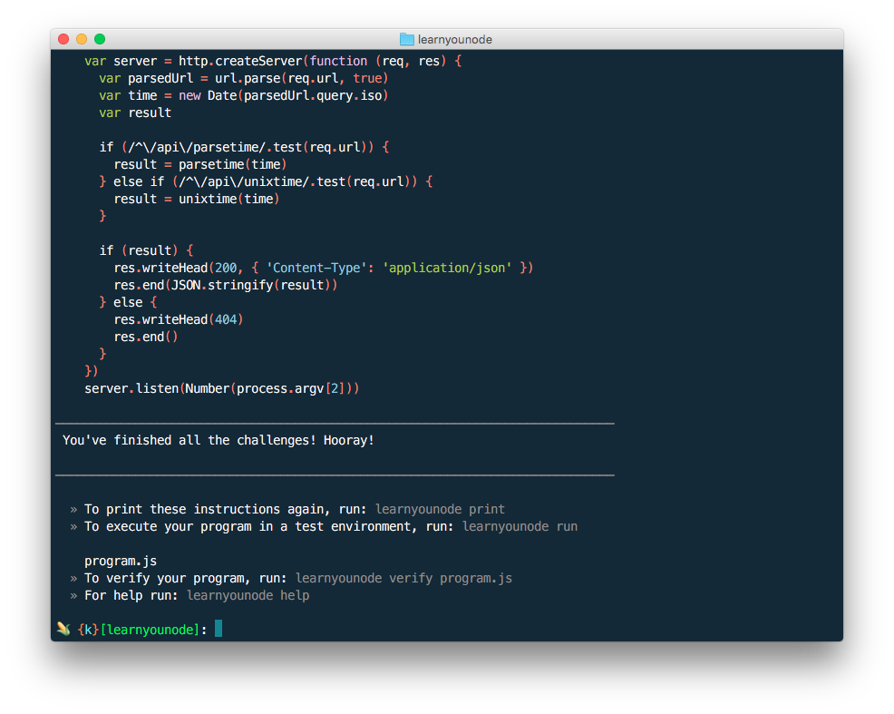

# Learn You Node

I followed the nodeschool course to understand more about nodejs and get familiar with it. I could say that it was really really tough for me to complete this course. I am not that experienced in javascript and need to learn a lot about solving problems. But I came trough.

## How I did it.
I found a lot of examples to complete some of the challanges. Without that I wouldn't completed it on my own. They showed me the posibilities on coding style and aproaches. I didn't want to copy and paste all those examples to be done with it so I started to make combinations of those examples. Then I refactored the code to my style en wrote some comments to show my understanding of it. 

## Resources
I didn't keep track of all those examples because it where to many. I founded most of the solutions on github and stackoverflow. I learned a lot from their struggles and why they wrote the code they wrote. So I want to thank all of developers who published their solutions.

